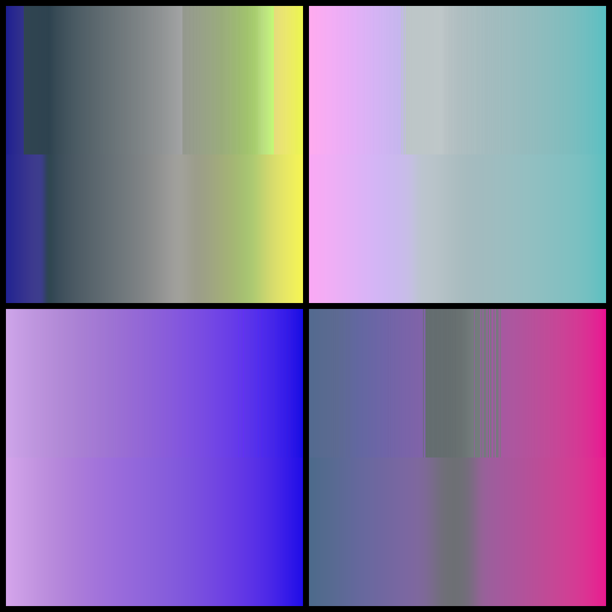
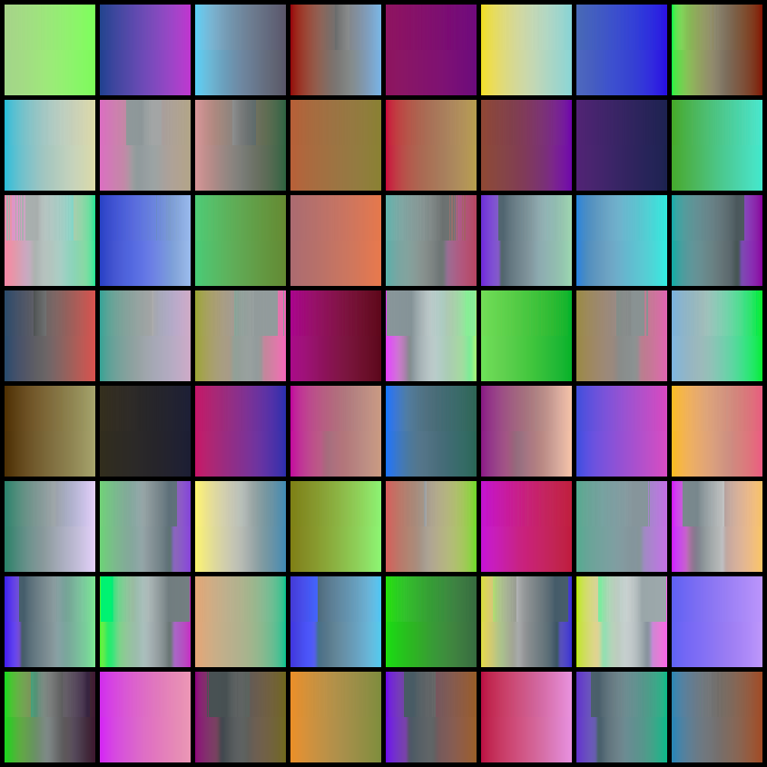

# ciede-gradient-nn
Training a neural network to approximate a novel color gradient function based on CIEDE2000.

## Background
**CIEDE2000** - a color difference formula based on human vision and used across industry.

**Color gradient** - an interpolation between two colors; a "path" from one color to another.

A novel gradient function has been developed based on CIEDE2000. It sometimes produces non-continuous gradients. Approximating it computationally requires a relatively long time.

This function was used to train a neural network, successfully reducing computation time while capturing its intricacies like non-continuity.

This repository contains the source code for the tools that were used to achieve this result:
 * *sample-generator* - generates training and testing data for the neural network
 * *nn* - creates, trains and tests a neural network
 * *image-generator* - a tool for visualizing how the neural network compares to the original function

## Building and Running

Requirements:
 * Rust toolchain
 * SDL2 developer libraries (for *image-generator* only)

```bash
cd sample-generator
cargo run --release
```
```bash
cd nn
cargo run --release
```
```bash
cd image-generator
cargo run --release
```

Note that *sample-generator* takes about 10 minutes to complete while using the default configuration.

*sample-generator* produces *data-[seed].csv* and *nn* produces *nn.json*.

All 3 tools have *config.ini* files that can be edited to change their configuration.

For convenience, *nn* uses provided *sample_data.csv* and *image-generator* uses provided *sample_nn.json*. This can be changed to user provided *data.cvs* and *nn.json* by setting `use_sample_data` and `use_sample_nn` to `false` in the respective configuration files.

## Previews
Top rows - a slow computational approximation of the CIEDE2000 gradient between 2 random colors. Bottom rows - a fast neural network approximation of the same.

The neural network used for the generation of these images is contained in *image-generator/sample_nn.json*. It was trained with 10.9 million samples for 80 epochs.



